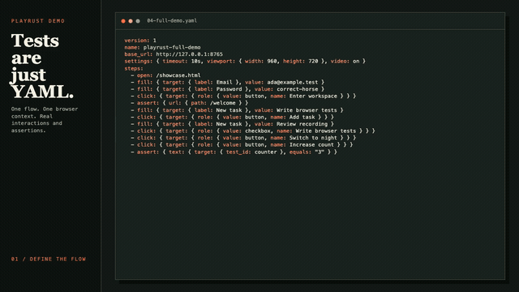

# Playrust

Playrust is a browser runtime for AI agents where every session leaves behind an audited, secret-safe, replayable test. An agent drives Chromium interactively over a JSON protocol; Playrust records everything, keeps credentials out of the model's hands, and on export compiles the successful actions into a canonical YAML flow that replays deterministically in CI.

## Why Playrust

- **The session trace is the product.** Every session produces an append-only redacted audit journal, continuous video, and an exported `replay.yaml` distilled from the successful actions — an agent's one-off browsing session becomes a regression test plus evidence.
- **A secret firewall at the wire.** Agents send `{"env":"NAME"}` instead of plaintext; the model never sees, logs, or exports credential values. Exported flows declare them as environment-backed secrets.
- **Replay fidelity by construction.** Interactive sessions and YAML replay share one execution core — the same locators, actionability, timeouts, and redaction — so the exported flow replays what actually happened, not an approximation of it.
- **Flows are data, not programs.** The YAML format has no code execution, bounded loops, immutable inputs, and full static validation (`playrust check`), so machine-authored flows are safe to accept, diff, and run without code review.

Playrust is a single static binary with a pinned Chrome for Testing build — no Node, no version-skew matrix. A Claude Code skill for driving sessions ships in [`skills/playrust-agent`](skills/playrust-agent/SKILL.md).

## Demo

[](docs/playrust-demo.mp4)

[Watch the full MP4](docs/playrust-demo.mp4). The demo shows the YAML flow, Chromium launch, and one continuous test covering sign-in, task management, and interactive controls.

## Install

Download the archive and matching `.sha256` file for your platform from the
[GitHub release](https://github.com/kashyaparjun/playrust/releases). Verify it,
extract it, and place `playrust` (or `playrust.exe`) on your `PATH`:

```sh
shasum -a 256 -c playrust-v*-*.sha256
```

On Windows, compare `Get-FileHash .\playrust-v*-*.zip -Algorithm SHA256` with
the checksum file. Release archives support Linux x86_64, macOS arm64/x86_64,
and Windows x86_64.

Alternatively, install a tagged version from source with Rust 1.89 or newer:

```sh
cargo install --locked --git https://github.com/kashyaparjun/playrust.git --tag v0.2.0 playrust
```

For a local checkout:

```sh
cargo install --path .
```

Run `playrust browser install` to preinstall the browser. `playrust run` also
installs pinned Chrome for Testing `151.0.7922.34` automatically if needed. You
can instead provide that exact build with `--browser PATH` or `PLAYRUST_CHROME`.

## Agent sessions

`playrust session --protocol ndjson` is the interactive agent interface. It eagerly opens one isolated Chromium context, reads one JSON command per stdin line, and writes one JSON response per stdout line; diagnostics go only to stderr. Every response contains the command `id`, `ok`, stable `session_id`, monotonically increasing `revision`, and either `result` or a structured `error`.

Session defaults match YAML: a `1280x720` viewport and `10s` action timeout. Video defaults to `on` and records continuously from session startup through close; use `--video off` to disable it. Dialog handling defaults to `--dialog-policy explicit`; `accept` and `dismiss` handle dialogs automatically for the entire session, with accepted prompts receiving an empty value.

The normal agent loop is open, snapshot, act on a current reference, scroll and resnapshot as needed, handle dialogs, export, then close:

```json
{"id":1,"command":"act","action":{"open":{"url":"https://example.com"}}}
{"id":2,"command":"snapshot","screenshot":"viewport","accessibility":true}
{"id":3,"command":"act","action":{"click":{"ref":"e12"}}}
{"id":4,"command":"scroll","y":700}
{"id":5,"command":"snapshot","screenshot":"viewport","accessibility":true}
{"id":6,"command":"dialog","action":"accept"}
{"id":7,"command":"export","name":"example-run"}
{"id":8,"command":"close"}
```

Snapshots contain compact semantic context and interactive elements with temporary `eN` references. References belong only to the latest snapshot, are never reused, and become stale after a newer snapshot, a successful mutation, navigation, page/frame switch, or node detachment. Take a new snapshot before every ref-based action; never treat a reference as a selector. This is deliberate: the agent structurally cannot act on a stale view of the page.

With explicit dialog handling, an action that opens a native dialog succeeds and reports it. While a dialog is pending, `act`, `scroll`, and `submit` return recoverable `dialog_pending`; `snapshot`, `dialog`, `export`, and `close` remain available. A blocked snapshot returns dialog metadata and `capture_status: "blocked_by_dialog"` instead of hanging.

`fill` and `select` accept literal values or environment-backed values such as `{"env":"TEST_PASSWORD"}`. Playrust resolves and redacts environment values; responses, journals, reports, and exported YAML contain the environment-variable name, never its plaintext value.

`export` is nonterminal and writes `<artifacts>/<name>/` with canonical `replay.yaml`, `session.ndjson`, `report.json`, referenced screenshots, and a pending recording result. Always export before close: `close` finalizes `recording.mp4` (or documents a partial recording) and the report into that bundle. If no export was requested, close uses the normal `session-<id>/` artifact directory. Validate exported flows with `playrust check <bundle>/replay.yaml`; replay them in a fresh browser with `playrust run`.

`submit`, `inspect`, `output`, and `cancel` remain protocol v1 compatibility commands. `submit` still accepts a complete inline YAML V1 flow, but must match the established session viewport/geolocation and does not start or stop the continuous recorder. `inspect` retains its existing raw response shape and is deprecated in favor of `snapshot`. See [`docs/session-protocol.md`](docs/session-protocol.md) for command/result shapes, recovery rules, stable errors, and the 1 MiB envelope limit.

## Running and replaying flows

Exported `replay.yaml` bundles — and hand-written flows — run headlessly with `playrust run`. Serve the included page in one terminal:

```sh
python3 -m http.server 8000 --directory examples
```

Then validate and run the flow:

```sh
export PLAYRUST_EXAMPLE_PASSWORD=local-secret
playrust check examples/example.yaml --var username=alice
playrust run examples/example.yaml --var username=alice
```

`check` validates YAML, inputs, URLs, durations, keys, subflows, flow control, and configuration without launching Chromium. `run` also compiles every discovered entrypoint and all of its subflows before installing or launching Chromium; one invalid specification prevents every flow from running. A path may be one `.yaml`/`.yml` file or a directory, searched recursively in stable path order. Files ending in `.subflow.yaml` or `.subflow.yml` are not directory entrypoints; they run only when included.

```text
playrust check <path> [--var NAME=VALUE]
playrust run <path> [--headed] [--jobs N] [--browser PATH]
                    [--var NAME=VALUE] [--video MODE]
                    [--ffmpeg-path PATH] [--artifacts DIR] [--junit] [--html]
playrust session --protocol ndjson [--headed] [--browser PATH]
                    [--viewport WIDTHxHEIGHT] [--timeout DURATION]
                    [--video on|off]
                    [--dialog-policy explicit|accept|dismiss]
                    [--ffmpeg-path PATH] [--artifacts DIR]
```

`run` defaults to headless mode, retained video recording, up to four concurrent flows, and `./playrust-artifacts`. Use `--video off` to disable recording or `--jobs 1` for sequential execution. Exit codes are `0` for success, `2` for invalid input/specification, `3` for an automation or assertion failure, `4` for infrastructure/recording failure, and `130` when interrupted.

## YAML V1

This is the format sessions export and `run` executes — flows are bounded, statically checkable data, never code. Every file requires `version: 1`, a non-empty `name`, and non-empty `steps`. Unknown fields, duplicate keys, aliases, merge keys, unresolved inputs, and multiple operations in one step are rejected. A step may also have a unique `id` and a `timeout` using an integer followed by `ms`, `s`, or `m`.

Defaults are a `10s` timeout, `1280x720` viewport, and video `on`.

```yaml
settings:
  timeout: 10s
  viewport: { width: 1280, height: 720 }
  video: retain-on-failure
  geolocation: { latitude: 51.5074, longitude: -0.1278, accuracy: 10 }
```

`geolocation` is optional. Latitude must be between `-90` and `90`, longitude between `-180` and `180`, and accuracy must be a non-negative number in meters; accuracy defaults to `0`. When set, Playrust grants geolocation permission only in that flow's isolated browser context and applies the coordinates to its page before any steps run.

### Subflows

Include reusable steps at compile time with a relative path:

```yaml
steps:
  - open: /login
  - run: ./shared/sign-in.subflow.yaml
  - run:
      path: ./shared/check-user.subflow.yaml
      vars: { expected_user: "${username}" }
  - assert: { url: { path: /dashboard } }
```

A subflow is a normal V1 document with `version`, `name`, and `steps`. `run` accepts either the original scalar path or `{ path, vars }`. Mapped values are interpolated in the caller and take precedence over CLI values and the called file's declared `vars`; unknown names and attempts to bind `secrets` are rejected. Secret-derived arguments remain secret-tainted in the child and are added to the entrypoint redactor.

Includes are expanded in place, may be nested up to 32 levels, and the expanded flow may contain at most 10,000 steps. Include paths are literal, must end in `.subflow.yaml` or `.subflow.yml`, and resolve relative to the file containing the `run` step. A `run` step may additionally use non-DOM `when`, `while`, `repeat`, or `retry`; no action field, `id`, `timeout`, or DOM `when` predicate is allowed. Canonical active include paths are checked for cycles; the same subflow may be included more than once when it is not already active.

Each file resolves its own `base_url`, default `settings.timeout`, `vars`, and `secrets`; these values are not inherited across file boundaries. CLI variables apply to every file that declares the name and are rejected unless at least one file declares them. Child secrets remain redacted in root-flow diagnostics. Subflows cannot set `settings.viewport` or `settings.video`; those runtime-wide settings belong to the entrypoint. Child names and resolved inputs do not replace the entrypoint's report identity or inputs. Runtime failures from expanded steps report both the expanded step number and child source path/local step number.

### Flow control

`when` has exactly one structured predicate:

```yaml
- when: { variable: { name: mode, equals: admin } }
  click: { target: { test_id: admin-panel } }
- when: { visible: { css: .optional-banner } }
  click: { target: { css: .dismiss } }
- when: { hidden: { css: .blocking-dialog } }
  open: /ready
- when: { platform: web }
  open: /web-only
- when:
    expression:
      all:
        - equals: { left: "${mode}", right: admin }
        - boolean: "${setup_ready}"
  open: /admin
```

`platform: web` matches this web-only runner and is resolved at compile time. Variable equality is resolved at compile time against a declared, immutable, non-secret variable. Both operands must be non-secret. DOM predicates are evaluated once, immediately before the operation: `visible` is true when any matching element is visible, while `hidden` is true when there is no visible match. They are snapshots and do not wait for the condition to change; protocol errors fail the step. DOM predicates are not supported on `run` because applying one independently to expanded child steps could partially execute a subflow.

`expression` is a structured boolean tree, not executable code. Its one operator is `all`, `any`, `not`, `equals`, `not_equals`, or `boolean`. Comparison operands and `boolean` are strings that may interpolate immutable inputs or previously saved runtime outputs. `boolean` accepts only the resolved text `true` or `false`; equality is exact string equality. Trees are limited to 8 nested levels and 64 nodes, lists must be non-empty, missing runtime outputs fail the step, and resolved values are never included in expression diagnostics. Evaluation has no page, filesystem, environment, network, or host-language access. `all` and `any` short-circuit.

`repeat: N` expands a step or subflow `N` times at compile time. `N` must be `1..=100`, the final flow remains limited to 10,000 steps, and a repeated leaf step cannot have an `id`. Normal expanded-flow uniqueness rules still reject repeated screenshot names.

`while` repeats a step or complete subflow while its structured expression is true:

```yaml
- while:
    expression: { boolean: "${has_more}" }
    max_iterations: 20
  run: ./fetch-page.subflow.yaml
```

`max_iterations` is mandatory and must be `1..=100`; its full expansion counts toward the 10,000-step flow ceiling. The condition is evaluated once at the start of each iteration. A false result ends that loop permanently, while reaching the maximum ends it successfully without another condition check. For a subflow, one condition snapshot gates the complete iteration, so outputs changed by an early child step do not partially skip later child steps. Cancellation and each child step's deadline still apply normally. A loop intentionally repeats its body; it does not retry a failed action, and failures stop the flow without replaying the failed step.

`retry: N` gives an assertion up to `N` additional attempts, each with the step's full timeout and normal cancellation checks. `N` must be `1..=10`. Actions cannot be retried, so pointer, keyboard, wheel, navigation, form, clear, and screenshot operations are never replayed after dispatch. A `run` may use `retry` only when its fully expanded child is assertion-only; the retry count is added to each child assertion at compile time and the combined count cannot exceed 10. This is per-assertion retry, not rollback or whole-subflow transaction retry. `when` and `retry` cannot be combined on one leaf step.

### Actions

| Action | Form |
| --- | --- |
| Navigate | `open: /path` (requires `base_url`) or an absolute HTTP(S) URL |
| Click | `click: { target: { test_id: submit }, position: { x: 8, y: 12 } }` |
| Click viewport point | `click: { point: { x: 100, y: 200 } }` |
| Double click | `double_click: { target: { test_id: item }, position: { x: 8, y: 12 } }` |
| Fill | `fill: { target: { label: Email }, value: "${username}" }` |
| Erase | `erase: { target: { label: Search } }` |
| Select option | `select: { target: { label: Region }, value: us-east }` |
| Scroll viewport | `scroll: { x: 0, y: 600 }` |
| Scroll until visible | `scroll_until_visible: { target: { text: "Last item" }, y: 400 }` |
| Swipe from target | `swipe: { target: { test_id: card }, x: -240, duration: 300ms }` |
| Long press | `long_press: { target: { test_id: menu }, duration: 500ms }` |
| Wait until visible | `wait_until_visible: { target: { css: .late } }` |
| Wait until stable | `wait_until_stable: { target: { css: .animated } }` |
| Navigate back | `back: {}` |
| Switch page | `switch_page: popup`, `switch_page: opener`, `switch_page: { name: checkout }`, or `switch_page: { url: /checkout }` |
| Enter iframe | `switch_frame: { target: { css: "#checkout" } }` |
| Switch frame | `switch_frame: parent` or `switch_frame: main` |
| Press | `press: { target: { label: Search }, key: Enter, modifiers: [Control] }` |
| Screenshot | `screenshot: { name: dashboard }` |
| Start recording | `recording: start` |
| Stop recording | `recording: stop` |
| Handle native dialog | `dialog: { action: accept }`, `dialog: { action: dismiss }`, or `dialog: { action: accept, text: "${answer}" }` |
| Clear cookies | `clear: cookies` |
| Clear local and session storage | `clear: storage` |
| Clear IndexedDB | `clear: indexeddb` |
| Clear Cache Storage | `clear: cache-storage` |
| Unregister service workers | `clear: service-workers` |
| Evaluate page JavaScript | `evaluate: { script: "return args[0]", args: [value], save_as: result }` |
| HTTP setup request | `request: { method: POST, url: "https://api.test/setup", expected_status: 201 }` |

Click, double click, fill, erase, select, swipe, long press, and press wait for one unique, visible, stable, enabled, uncovered target; fill and erase also require an editable target. Click and double-click optionally accept `position`, an unsigned CSS-pixel offset from the target's top-left border box. The position must be inside the target, inside the viewport, and hit the target or one of its descendants; hit testing is performed at that exact position. Without `position`, the target center is used. A targetless click instead accepts Maestro-style absolute viewport coordinates as `point: { x, y }`. The point is validated against the configured CSS-pixel viewport, dispatches exactly one click without locator lookup, waiting, scrolling, uniqueness, or element actionability checks, and is reported as `click.point`; it cannot be combined with `target` or `position`. Erase supports the same text inputs, textareas, and content-editable elements as fill. Select accepts an option value (including an empty value) on a native, non-`multiple` `<select>` and dispatches one bubbling `input` event followed by one `change` event. Swipe and long press dispatch one mouse gesture after actionability succeeds. Input actions are not retried after pointer, keyboard, wheel, or form event dispatch begins.

Scroll sends one wheel input at the viewport center; positive values move right/down and negative values move left/up, and at least one axis must be non-zero. `scroll_until_visible` repeats one bounded wheel delta until its unique target is visible or the step deadline expires, allowing a target that is initially absent from a virtualized list. Its `x` and `y` values, and swipe offsets, are limited to `-10000..=10000` CSS pixels and cannot both be zero. A swipe endpoint must remain inside the viewport. Swipe defaults to `300ms`; long press defaults to `500ms`; either duration must be positive and at most `10s`, and must fit within the remaining step deadline.

`wait_until_visible` is the explicit positive visibility wait; set a longer step `timeout` when the normal flow timeout is too short. `wait_until_stable` waits for a unique visible target whose bounding box is unchanged across two polling samples. Both use the same locator polling and deadline diagnostics as actionability. Back navigates one browser-history entry and fails when there is no previous entry. Supported named keys are `Enter`, `Tab`, `Escape`, `Space`, `Backspace`, `Delete`, arrow keys, `Home`, `End`, `PageUp`, and `PageDown`. A key may also be one printable non-whitespace character. Modifiers are `Alt`, `Control`, `Meta`, and `Shift`.

`dialog` responds to a pending native `alert`, `confirm`, `prompt`, or `beforeunload` dialog. Prompt text is optional and is valid only with `action: accept`. The step fails as an automation error when no dialog is pending.

`switch_page: popup` waits for exactly one page opened by the active page; `switch_page: opener` returns to its opener. `{ name: value }` matches the exact `window.name`, and `{ url: value }` matches one exact resolved HTTP(S) URL; a relative URL requires `base_url`. Named and URL selectors search only the current flow's isolated browser context and fail if multiple pages match. Page switching requires `settings.video: off` because chromiumoxide cannot safely hand an active screencast between page targets. The configured viewport and geolocation are applied to each newly active page. Locators, URL assertions and failure diagnostics, screenshots, storage clearing, and subsequent actions use the active page. The isolated browser context owns and cleans up every page.

`switch_frame` accepts a locator for one `<iframe>`/`<frame>`, `parent`, or `main`. Locators, frame URL assertions and diagnostics, screenshots, DOM storage clearing, scrolling, desktop-mouse swipe, fill, click, and evaluation use the active frame; a full frame screenshot captures its visible viewport. Live tests cover nested same-origin frames, cross-origin OOPIFs, mixed nested frame trees, and active-frame navigation through same-origin to cross-origin and back process replacements using Playrust's context-scoped CDP router. Back navigation remains unsupported while any frame is active; switch to `main` first.

Screenshots are PNG files written atomically to the flow artifact directory as `<name>.png`. Names may contain 1-64 ASCII letters, numbers, `-`, or `_`, must start and end with a letter or number, cannot be `failure` or a Windows-reserved filename, cannot contain secrets, and must be case-insensitively unique within a flow. An optional crop uses viewport-relative CSS pixels and must fit within the configured viewport:

```yaml
- screenshot:
    name: dashboard-panel
    crop: { x: 40, y: 80, width: 640, height: 360 }
```

`clear: cookies` clears every cookie in the active flow's isolated browser context only. `clear: storage` clears only `localStorage` and `sessionStorage` for the active page origin. `clear: indexeddb` deletes the active origin's named IndexedDB databases, `clear: cache-storage` deletes its Cache Storage entries, and `clear: service-workers` unregisters its service workers. These targets are deliberately separate: none of the three broader browser-storage commands clears cookies, local storage, or session storage. All clear commands remain inside the active flow's isolated browser context, use the step timeout, and produce normal cancellation and failure diagnostics. IndexedDB deletion fails if an open connection blocks it.

### Scripts, HTTP, and runtime outputs

`evaluate` runs a JavaScript function body in the active page's main frame and optionally stores its return value:

```yaml
- evaluate:
    script: return { token: args[0], title: document.title };
    args: ["${seed}"]
    save_as: page_result
```

The script is trusted page code, not a sandbox. It has the page's normal JavaScript access and can change the DOM, read page data, or make network requests. Flow values are never substituted into `script`; positional `args` are resolved and passed separately through the browser protocol as strings. Promises are awaited. A page JavaScript exception is a recoverable `script` automation failure; an underlying CDP failure remains fatal. A `save_as` result must be representable as JSON and its serialized form must not exceed 64 KiB; `undefined` and other non-JSON results cannot be saved.

Use `request` for bounded HTTP setup without hand-written page networking:

```yaml
- request:
    method: POST
    url: https://api.example.test/setup
    headers:
      authorization: "Bearer ${token}"
      content-type: application/json
    body: '{"ready":true}'
    expected_status: 201
    save_as: setup_response
```

Methods are limited to `GET`, `POST`, `PUT`, `PATCH`, `DELETE`, `HEAD`, and `OPTIONS`; URLs must be absolute HTTP(S), at most 100 headers are accepted, and request/response bodies are limited to 64 KiB. The step deadline bounds the entire request. Transport, status, and response-body failures are recoverable `request` automation failures. A status other than `expected_status` fails the step. When saved, an empty response becomes JSON `null`, a valid JSON response keeps its JSON type, and any other response is stored as a string.

Saved values are scoped to one `run` flow. In a persistent session they instead remain available across later submissions in that session. Names use input syntax, and values are available only to later `fill.value`, `select.value`, `evaluate.args`, and `request` URL/header/body fields as `${name}`. Strings interpolate directly; other JSON values use compact JSON. Repeated expansions of the same source producer replace that producer's previous value; distinct producers cannot share a name. A consumer after a DOM-conditional producer fails at runtime if the producer was skipped. Runtime outputs are always treated as secret, including values derived from apparently public page or HTTP data, and are size-bounded and redacted from diagnostics. They can still appear in screenshots or videos after being rendered by the page.

### Selectors

```yaml
target: { css: "button.primary" }
target: { test_id: submit }
target: { text: "Sign in" }
target: { text: { value: "Welcome", match: contains } }
target: { label: Email }
target: { role: { value: button, name: "Sign in" } }
target: { css: ".row", checked: true, enabled: true, index: 0 }
target:
  role: { value: button, name: Save }
  within: { test_id: editor }
  child_of: { css: .toolbar }
  has: { text: Ready }
  above: { text: Footer }
```

Each target has exactly one strategy. `test_id` matches `data-testid`. Label and role use Chromium accessibility names. Text matching is case-sensitive, whitespace-collapsed, and exact unless `match: contains` is set.

The optional boolean filters `checked`, `selected`, `focused`, and `enabled` match the corresponding live DOM state. `checked` applies only to checkable elements, `selected` only to selectable elements, and `enabled` accounts for native disabled controls, inert ancestors, and `aria-disabled="true"` ancestors. An optional zero-based `index` then selects from the filtered matches in DOM order.

Relations are additional filters and may be combined. `within` requires the candidate to be a descendant of a relation match; `child_of` requires the candidate's direct parent element to match; `has` requires it to contain a matching descendant. `above`, `below`, `left`, and `right` require non-overlapping bounding boxes in that direction, so overlapping or empty boxes do not match. Each relation value is another complete locator with exactly one base strategy and may recursively contain relations up to eight levels deep. At every level, base matches are placed in DOM order, state and relation filters run before `index`, and only the outer locator is checked for final uniqueness and actionability. Secret-derived values in any nested relation redact the complete locator diagnostic.

### Assertions

```yaml
- assert: { visible: { text: Welcome } }
- assert: { hidden: { css: .spinner } }
- assert:
    text: { target: { test_id: status }, equals: "Saved" }
- assert:
    text: { target: { css: .message }, contains: "complete" }
- assert: { url: { equals: "https://example.test/dashboard" } }
- assert: { url: { path: "/dashboard?tab=home" } }
- assert:
    screenshot:
      baseline: baselines/dashboard.png
      crop: { x: 40, y: 80, width: 640, height: 360 }
      channel_tolerance: 2
      max_changed_ratio: 0.001
```

Positive assertions require one unique visible target. `hidden` passes with no matches or when all matches are hidden. URL `equals` compares the full URL; `path` compares the encoded path and, when supplied, query while ignoring origin and fragment. Actions and assertions wait until their condition passes or the step deadline expires; only assertions accept explicit `retry` attempts.

Screenshot assertions capture the fixed viewport once and compare RGBA channels against a PNG baseline. `crop` is optional and uses the same viewport-relative bounds as named screenshots. `channel_tolerance` defaults to `0` and permits an absolute difference of up to that value in each channel. A pixel is changed when any channel exceeds the tolerance; `max_changed_ratio` defaults to `0` and accepts a value from `0` through `1`. Dimension mismatches always fail.

Baseline paths must be relative `.png` paths without `..`, resolve from the flow file containing the assertion (including subflows), and cannot contain secrets. Images are limited to 64 MiB encoded, 8192 pixels per axis, and 16,777,216 pixels total, with decoder allocation limits applied before decoding. Playrust does not provide a baseline-update mode. Keep baseline creation and review explicit in your repository workflow.

## Variables and secrets

```yaml
vars:
  region: local
  username: { env: TEST_USERNAME, default: guest }
secrets:
  password: { env: TEST_PASSWORD }
```

Use `${name}` in YAML strings. Variables are immutable literals or environment mappings with an optional default; `--var NAME=VALUE` overrides only names declared under `vars`. Secrets must be environment mappings and cannot have defaults or CLI overrides. Secret-derived and runtime-output-derived values are redacted from terminal diagnostics and `report.json`, but screenshots and videos can contain secrets rendered by the tested page.

Treat flow files as executable test configuration. They can navigate to private services and transmit environment values whose names are explicitly declared in the flow.

## Video and artifacts

Video modes are `off`, `on`, and `retain-on-failure`. Recording defaults to `on`, which keeps every recording and prints its path after the flow finishes. `retain-on-failure` removes recordings for passing flows. Set a mode in YAML or override all flows with `--video MODE`.

With no recording steps, video still covers the whole flow. To record one deliberate segment, add exactly one ordered `recording: start` / `recording: stop` pair; `check` rejects unmatched, reversed, or repeated controls after subflows are expanded. `--video off` makes a valid pair a no-op. A failure or interruption before `stop` still finalizes and reports the active recording. A completed manual recording remains reportable if a later step fails, and `retain-on-failure` removes it only after the entire flow passes.

Recording requires an `ffmpeg` executable on `PATH`, or `--ffmpeg-path PATH`, with the `libx264` encoder. Playrust records the fixed page viewport as silent 15 FPS MP4/H.264 for broad player compatibility; enabled video requires even viewport dimensions. Browser chrome, audio, OS dialogs, and a guaranteed pointer image are not recorded.

Each `run` writes `<artifacts>/report.json`. Pass `--junit` to also atomically write `<artifacts>/junit.xml`; automation failures are JUnit failures, while invalid specifications, infrastructure failures, and interruptions are JUnit errors. Pass `--html` to atomically write `<artifacts>/report.html`, a self-contained static summary with inline CSS, no scripts or external resources, and plain-text artifact paths. Optional reports are removed when their flags are omitted, so stale output cannot be mistaken for the current run. Successful named screenshot paths are listed under each flow's `artifacts.screenshots`. A failed screenshot assertion retains `__visual-<step>-actual.png` and a `__visual-<step>-diff.png` whose changed pixels are red, reported as `visual_actual` and `visual_diff`; diagnostics do not expose the baseline path. Per-flow directories may also contain `failure.png`, `recording.mp4`, or `recording.partial.mp4` when finalization fails. Change the root with `--artifacts DIR`.

## Boundaries

Playrust supports only its pinned Chromium build and rejects a different version supplied by path. V1 supports popup, opener, exact named/URL page selection, and the tested same-origin and cross-origin frame behavior described above. Shadow-root traversal, uploads/downloads, browser extensions, and mobile-native automation are not supported. Swipe and long press retain mouse semantics because desktop Chrome touch emulation synthesizes an additional, timing-incompatible mouse sequence. Flows are sequential and do not provide sleeps, mutable variables, unbounded loops, transactional subflow retries, dynamic paths, plugins, arbitrary host expressions, or a JavaScript sandbox.

See [`examples/example.yaml`](examples/example.yaml) for a complete runnable V1 flow.
